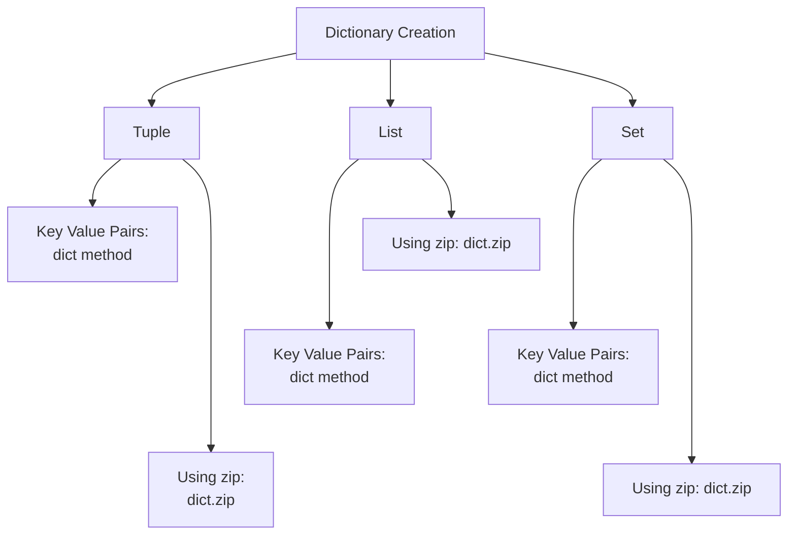

- List /Tuples/Set
	- collection of Key-Value pairs
	- Collection of Keys and Collections of Values(Separately)
- Pandas Dataframe
- JSON
- CSV

# Using List/Tuple/Set

```mermaid
graph TD; 
A[Dictionary Creation] --> B[Tuple]; 
A --> C[List]; 
A --> D[Set];
B --> B1[Key Value Pairs:\n dict method];
B ----> B2[Using zip:\n dict.zip];
C ---> C1[Key Value Pairs:\n dict method];
C --> C2[Using zip: dict.zip];
D ---> D1[Key Value Pairs:\n dict method];
D ----> D2[Using zip: dict.zip];


```

