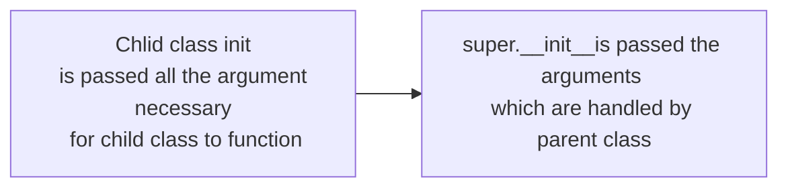

```mermaid
flowchart LR
    A[Chlid class init\n is passed all the argument necessary\n for child class to function] --> B[super.__init__is passed the arguments \nwhich are handled by parent class]
    
```

